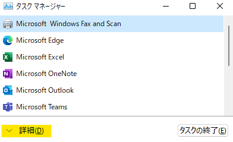
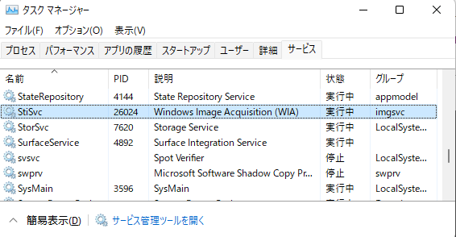
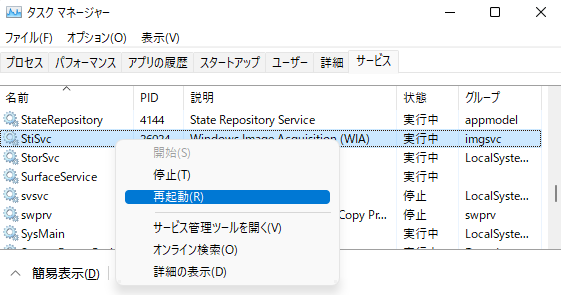

この記事では、Windows 11 に USB スキャナーを接続した問題について説明します。
<!-- more -->
 

***
### 概要
現在、Windows 11 において、次のような操作を行うと USB スキャナーのドライバーのロードに失敗して、スキャナーが正しく動作しない問題があることを確認しています。

(1) Windows が起動している状態で USB スキャナーを接続します。

(2) スキャナーと PC が接続されている USB ケーブルを抜く、またはスキャナーの電源をオフにします。

(3) Windows を再起動します。

(4) Windows 起動後、再度 USB スキャナーを接続、あるいは電源をオンにします。

結果：USB スキャナーを使用するアプリケーションを起動し、スキャナーの利用を試みると、スキャナー ドライバーの有無に関わらず [このデバイスを使用するには WIA ドライバーが必要です。] というエラーが表示されます。

 

***
### 回避方法
お手数おかけいたしますが、この問題に遭遇した場合、次の手順に沿って Windows Imaging Acquisition (WIA) サービスを再起動して、問題を解消してください。

(1) Ctrl + Shift + Esc キーを押下して、タスク マネージャーを起動します。

(2) ウィンドウ下部にある [詳細] をクリックして、詳細表示に切り替えます。
   

   
   

(3) [サービス] タブに移動して、StiSvc を見つけます。
   

   
   

(4) StiSvc を右クリックして [再起動] を選び、サービスの再起動を行い、問題を解消します。
   

   
   

 

***
### 状況

この現象については、Windows 11 の不具合であると認識しており、現在調査中となります。

 

***
### 開発者向け詳細情報
この現象による問題かどうかについては c:\windows\debug\WIA\wiatrace.log を参照することで、判断することができます。  
Windows 11 において、ドライバーをインストールしているにもかかわらず、概要に記載のようなエラーが表示される場合、WIA Trace Log に次のようなログが出力されていないかご確認ください。USDWrapper::LoadDriver のエラーコードとして `hr = 0x80070057` が記録されている場合、この現象に該当していると考えられます。   
~~~
WIA: xxxx.yyy zzz 0 0 [wiaservc.dll] ERROR: USDWrapper::LoadDriver, We encountered an error attempting to load driver for (YourScannerName), error (0x80070057)
WIA: xxxx.yyy zzz 0 0 [wiaservc.dll] ERROR: DeviceListManager::ProcessDeviceArrival, The driver for device (YourScannerName) failed to load (hr = 0x80070057)
~~~

***
`変更履歴`  
`2021/12/31 created by riwaida`

※ 本記事は 「[jpwdkblog について](https://jpwdkblog.github.io/blog/2020/01/01/aobut-jpwdkblog/)」 の留意事項に準じます。  
※ 併せて 「[ホームページ](https://jpwdkblog.github.io/blog/)」 および 「[記事一覧](https://jpwdkblog.github.io/blog/archives/)」 もご参照いただければ幸いです。  
